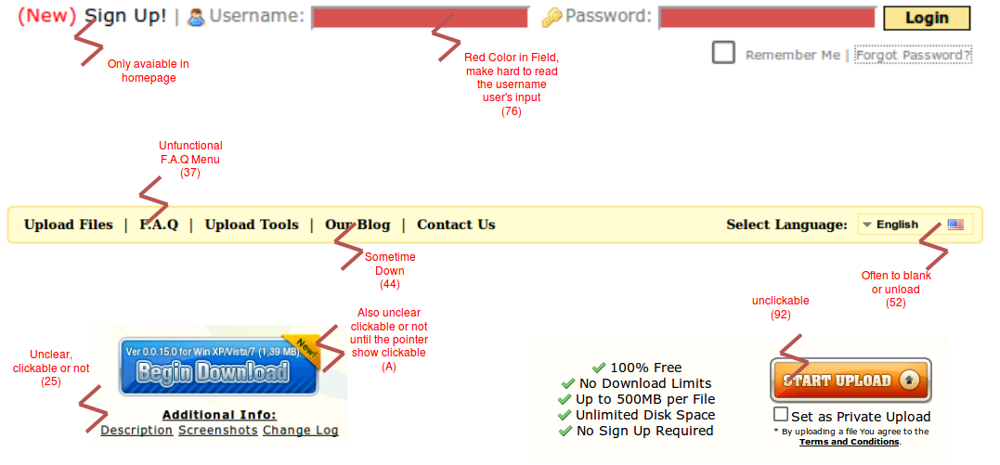
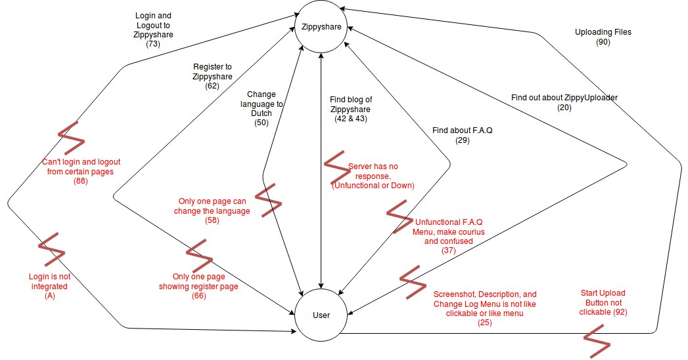
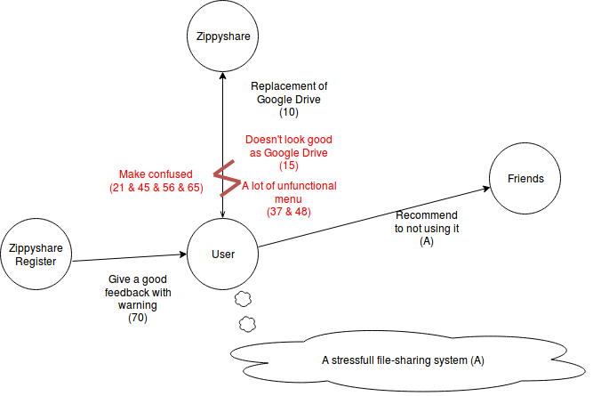

# Contextual Inquiry and Analysis of ZippyShare

## Outline
- [Contextual Inquiry and Analysis of ZippyShare](#contextual-inquiry-and-analysis-of-zippyshare)
    - [Outline](#outline)
    - [ZippyShare Description](#zippyshare-description)
    - [Instruction Script](#instruction-script)
    - [User Description](#user-description)
    - [Transcript](#transcript)
    - [Models and Annotations](#models-and-annotations)
        - [Artifact Model](#artifact-model)
        - [Flow Model](#flow-model)
        - [Cultural Model](#cultural-model)
    - [Do's and Don't's](#dos-and-donts)
        - [Do's](#dos)
        - [Don't's](#donts)

## ZippyShare Description


ZippyShare.com was incorporated in 2006, with the intention of providing a lightweight and user-fiendly file sharing solution.

With it's maximum upload limit as 500 MB, it is certainly aimed at the more casual and leisure-oriented user. This certainly tallies with its reputation as a music-sharing platfrom, as tis figure means that any blue-ray disc shared via ZippyShare would need to be split into 50 parts - which isn't feasible!

Many users of ZippyShare have complained about its automatic deleting of the files following 30 days of inactivity. This is certainly something that you wouldn't expect from the big names on the market, such as DropBox. However, this is actually rather common across the industry, certainly with the smaller file-sharing services.

While it should also be noted that this is a very basic platform compared to others that are available, some users of ZippyShare have also complained about the levels of privacy available.

ZippyShare has intention of providing user-friendly file sharing solution, but many users prefer to use other platforms to share files because the User Inferface (UI) of Zippyshare is unattractive and sometimes does not work or work but on certain pages.


## Instruction Script

On this section, it will countain spesific instruction given to user. Bellow is the following instruction

1. Find out what ZippyUploader is and what is like.
2. Find F.A.Q (Frequently Asked Question) of ZippyShare and take one question.
3. Find Blog of ZippyShare.
4. Try Changing the Language to Dutch.
5. Try to Register into the ZippyShare from current page.
6. Try Login to ZippyShare and figure out what's wrong.
7. Try to upload file


## User Description

- The user is a female student of Business Management Department ITS.
- Her name is Vita.
- She has experience using a computer as she was do a homework.
- In her college assigment she used a website to login and do a homework or logout, but not too often.
- She rarely using *file-sharing*, the only *file-sharing* she knows is Google Drive, and she absolutely doesnt know about Zippyshare.


## Transcript

```text
1. Ferdinand    :   Pernahkah kamu membagikan file terhadap teman maupun saudara atau bahkan orang tua ?
2. Vita         :   Pernah
3. Ferdinand    :   Bagaimana cara kamu membagikan file tersebut ?
4. Vita         :   pake FlashDisk
5. Ferdinand    :   Oke, kemudian bagaimana cara kamu membagikan file terhadap temanmu yang misal di jakarta ?
6. Vita         :   Hmmmm, saya belum sering menggunakannya secara langsung, mungkin bisa menggunakan Google Drive dalam hal tersebut.
7. Ferdinand    :   Apakah kamu pernah mendengar Zippyshare ?
8. Vita         :   Itu apa wkwkwkwk
9. Ferdinand    :   Zippyshare adalah salah satu platform untuk *file-sharing*, selain google drive, jadi kamu upload nanti di download oleh orang lain, secara teknis mirip dengan Google Drive.
10. Vita        :   Oke paham, sih lumayan bisa digunakan sebagai pengganti google drive kapan kapan.
11. Ferdinand   :   Sip, sekarang coba buka Zippyshare.
12. Ferdinand   :   Lebih tepatnya pake link ini (https://www.zippyshare.com/sites/uploader.jsp)
13. Ferdinand   :   Nah coba buka website tersebut menggunakan laptop maupun hp.
14. (Vita membuka website tersebut menggunakan laptop).
15. Vita        :   Oke, sudah. Tidak sebagus Google Drive.
16. Ferdinand   :   Sekarang coba cari tahu mengenai ZippyUploader dan seperti apa itu.
17. (Vita membaca website tersebut, dan mencari tahu mengenai bentuk ZippyUploder).
18. Vita        :   Sek baca dan mencari
19. Ferdinand   :   Oke siap
20. (Vita menjelaskan apa itu ZippyShare dan mencari contoh bentuk ZippyUploader pada laman tersebut)
21. (Vita sedikit kebingungan terhadap tugas ini).
22. (Setelah beberapa detik, Vita menemukan bentuk ZippyUploader pada laman tersebut).
23. Vita        :   Nah kaya gitu (menunjukan ScreenShot dari website tersebut). 
24. Ferdinand   :   Bagaimana mengenai hal tersebut ?
25. Vita        :   Ga kaya website lain gitu ada tombol atau panelnya, dia kaya tulisan biasa, ku pikir tidak bisa di klik.
26. Ferdinand   :   Oke sip wkwk, lanjut
27. Ferdinand   :   Setiap website pasti punya FAQ atau Frequently Asked Question, coba dari laman tersebut cari FAQ nya, dan berikan 1 pertanyaannya.
28. Vita        :   Oke.
29. (Vita melihat di laman tersebut, dan menemukan menu F.A.Q dan mencoba mengeklik tombol tersebut beberapa kali.)
30. (Vita sesekali menunggu laman tersebut)
31. (Setelah beberapa saat)
32. Ferdinand   :   Bagaimana ?
33. Vita        :   Menu e sudah diklik tapi ga respon, mungkin internetnya lemot atau mungkin gabisa di klik.
34. Ferdinand   :   Oke wkwkw, memang menunya ga ada.
35. Vita        :   Ealah ternyata.
36. Ferdinand   :   Iya, kemudian bagaimana pendapatmu ?
37. Vita        :   Ya kalau emang ga ada F.A.Q nya mending gausah dibikinin menu, bikin orang penasaran, ini internetnya yang lemot atau emang ga bisa.
38. Ferdinand   :   OKe, lanjut
39. Ferdinand   :   Sekarang, beberapa blog dari website merupakan tempat memberikan status terhadap website tersebut, seperti pengumuman maintenance ataupun pengumuman mengenai feature baru.
40. Ferdinand   :   Coba cari blog nya.
41. Vita        :   Oke.
42. (Vita mencari blog pada laman tersebut)
43. (Vita menemukan menu blog, kemudian mencoba klik kemudian laman tersebut loading)
44. (Setelah sekian lama ternyata website blog tersebut sedang down serta memberikan respon *Request Time Out*)
45. (Vita bingung)
46. Vita        :   Lha dadi error, gimana ?
47. Ferdinand   :   Gapapa itu artie websitenya situ lagi down, gimana menurutmu ?
48. Vita        :   Kalau misal sebagai pusat informasi ya harusnya jangan sampe down, atau ditempatkan di website utamanya entah di menu utama atau dibuat post gitu.
49. Ferdinand   :   Oke deh, lanjut
50. Ferdinand   :   Coba sekarang ganti bahasa ke bahasa belanda, menggunakan fitur yang telah tersedia pada ZippyShare. (fitur tersebut ada).
51. Vita        :   Oke
52. (Pada laman yang vita buka ternyata fitur tersebut belum ter-load)
53. (Vita mencari cara untuk mengganti bahasa, mengarahkan mouse pointer ke segala arah yang bisa di klik)
54. (Setelah sekitar 1 menit, vita memutuskan untuk reload laman tersebut)
55. (Setelah reload, fitur tersebut terload, kemudian Vita mencoba untuk mengeklik dan mengganti bahasa pada laman tersebut)
56. (Ternyata Bahasa pada Laman tersebut belum terganti, kemudian Vita bingung)
57. (Vita mencoba beberapa kali reload serta berpindah pindah laman)
58. (Setelah sekitar 9 menit, akhirnya vita menemukan cara mengganti bahasa dengan berada di laman utama dan kembali ke laman pertama dengan bahasa sudah terganti ) 
59. Vita        :   Itu sudah terganti
60. Ferdinand   :   Mantab, oke siap lanjut ?
61. Vita        :   Lanjut
62. Ferdinand   :   Sekarang coba untuk register/daftar ke dalam ZippyShare, supaya jadi member di ZippyShare
63. Vita        :   Oke
64. (Vita mencari tulisan register/daftar pada laman tersebut)
65. (Setelah sekitar 1 menit Vita terlihat kebingungan karena tidak menemukan tulisan register/daftar)
66. (Setelah 5 menit Vita menemukan register/daftar hanya pada laman tersebut, dan tidak pada laman yang lain )
67. (Kemudian Vita mengisi form pada laman tersebut, )
68. Vita        :   Oke sudah
69. Ferdinand   :   Oke bagaimana pendapatmu ?
70. Vita        :   Tulisan Register/Daftar hanya ada di satu laman saja, jadi susah mencarie haruse disemua laman terdapat tulisan tersebut. Tapi pas daftar lumayan, ada peringatan peringatan gitu
71. Ferdinand   :   Siap, oke lanjut terakhir ya
72. Vita        :   Oke. 
73. Ferdinand   :   Coba login ke website tersebut dan kembali ke link awal (https://www.zippyshare.com/sites/uploader.jsp) kemudian melakukan logout pada halaman tersebut.
74. Vita        :   Oke.
75. (Vita melalukan login, tetapi passwordnya salah)
76. (Zippyshare melakukan response dengan memberikan field berwarna merah tua)
77. (Vita kesulitan melihat pada field username dan password karena warna nya kurang kontras)
78. (Vita melakukan login walaupun dengan warna merah tua dan kembali ke link awal)
79. (Ternyata pada laman tersebut, vita belum terlogin)
80. (Vita mencoba mereload beberapa kali)
81. (Vita mencoba kembali ke halaman awal login, terdapat bahwa Vita sudah terlogin)
82. Vita       :   Lha ini ada, sebentar
83. Fedinand   :   Oke
84. (Vita kembali ke halaman https://www.zippyshare.com/sites/uploader.jsp, kemudian menemukan bahwa dirinya belum terlogin kembali)
85. (Kemudian Vita login dari halaman awal, tetapi tidak memberikan response apa apa)
86. (Setelah sekitar 4 menit vita menemukan bahwa bisa logout di laman lain)
87. Setelah sekitar 3 menit vita menyerah)
88. Vita        :   Ga bisa logout dari sini, harus dari halaman yang lain
89. Ferdinand   :   Oke sip terima kasih atas response nya
90. Ferdinand   :   Lanjut sekarang coba upload file dihalaman pertama
91. (Vita mencoba mengupload file, setelah 3 menit)
92. Vita        :   Di klik start upload gabisa. Menyerah deh, bingungg
93. Ferdinand   :   Oke dehh, kemudian secara overall bagaimana ?
94. Vita        :   Stress aku pake website itu, bingungi
95. Ferdinand   :   Oke terima kasih atas segalanya
96. Vita        :   Gapapa oke, sudah selesai ?
97. Ferdinand   :   Iya, sudah terima kasih.
98. Vita        :   Oke.
```

## Models and Annotations

### Artifact Model


### Flow Model


### Cultural Model



## Do's and Don't's

### Do's
1. Login and Logout must be integrated with all pages.
2. Use button instead of picture.
3. Sign Up options in all pages.
4. Redesigning Menu and sub-menu
5. Make responsive

### Don't's
1. Field filled with red color, hard to read.
2. Place unfunctional menu on menubar.

